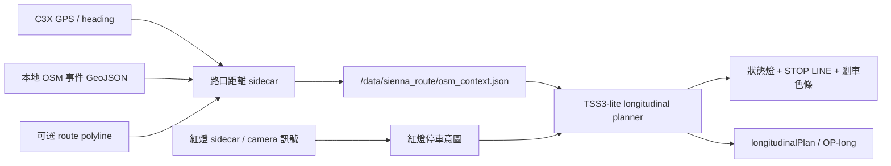

# 系統架構

## 整體流程



## 距離來源優先順序

1. 有 route 時，使用 route-projected OSM event distance。
2. 沒 route 時，使用 GPS heading-cone OSM event distance。
3. 外部 `/intersection_distance` bridge，只作為備援或人工驗證。
4. Camera FAR/MID/NEAR 僅作弱 fallback，不當作真正距離。

## 低負載原則

- 不自動啟動完整 OSM sidecar。
- OSM GeoJSON 只在檔案 mtime 變化時重新載入。
- runtime 只查 GPS 附近 grid cell，不掃全圖。
- 預設週期 `1.5 s`。
- 只有 onroad、enabled、車子有移動、GPS 有值時才計算。
- log 小容量輪替，避免磁碟空間異常。

## 主要參數

- `SiennaIntersectionDistanceAssist=1`
- `SiennaIntersectionDistancePeriodS=1.5`
- `SiennaIntersectionDistanceMinSpeedKph=3.0`
- `SiennaIntersectionDistanceMaxCrossTrackM=70.0`
- `SiennaIntersectionDistanceLookaheadM=300.0`
- `SiennaIntersectionDistanceMapRadiusM=350.0`
- `SiennaIntersectionDistanceHeadingConeDeg=35.0`
- `SiennaIntersectionDistanceMaxLateralM=55.0`
- `SiennaIntersectionDistanceEventCrossTrackM=45.0`

## 輸出格式

sidecar 會寫出 planner 可讀的 context，例如：

```json
{
  "status": "active",
  "route_safety": {
    "active": true,
    "reason": "intersection_distance_sidecar"
  },
  "next_osm_event": {
    "distance_m": 120.0,
    "type": "traffic_signals",
    "source": "osm_geojson:...",
    "confidence": 0.9
  },
  "distance_compute_ms": 0.6
}
```

重要原則：GPS/OSM 距離只能在紅燈意圖已存在時幫助決定剎車時機，不能自己創造「該停車」的判斷。

