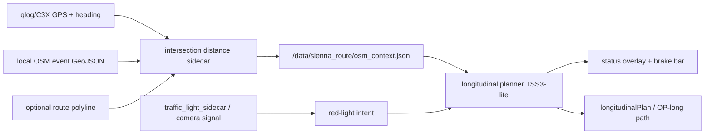

# Architecture

## High-Level Flow



## Distance Source Priority

1. Route-projected OSM event distance when route polyline exists.
2. GPS heading-cone OSM event distance when no route exists.
3. External bridge `/intersection_distance` for fallback/manual validation.
4. Camera FAR/MID/NEAR only as a weak fallback when no distance exists.

## Low-Load Design

- No full OSM sidecar autostart for this layer.
- OSM GeoJSON is parsed only on file mtime change.
- Runtime loop queries a small grid around the current GPS point.
- Default period is `1.5 s`.
- Distance calculation runs only when enabled, onroad, moving, and GPS is available.
- Logs rotate at a small size to reduce disk risk.

## Main Runtime Params

- `SiennaIntersectionDistanceAssist=1`
- `SiennaIntersectionDistancePeriodS=1.5`
- `SiennaIntersectionDistanceMinSpeedKph=3.0`
- `SiennaIntersectionDistanceMaxCrossTrackM=70.0`
- `SiennaIntersectionDistanceLookaheadM=300.0`
- `SiennaIntersectionDistanceMapRadiusM=350.0`
- `SiennaIntersectionDistanceHeadingConeDeg=35.0`
- `SiennaIntersectionDistanceMaxLateralM=55.0`
- `SiennaIntersectionDistanceEventCrossTrackM=45.0`

## Output Contract

The distance sidecar writes planner-readable context similar to:

```json
{
  "status": "active",
  "route_safety": {
    "active": true,
    "reason": "intersection_distance_sidecar"
  },
  "next_osm_event": {
    "distance_m": 120.0,
    "type": "traffic_signals",
    "source": "osm_geojson:...",
    "confidence": 0.9
  },
  "distance_compute_ms": 0.6
}
```

The red-light planner should use this distance only after camera/sidecar red intent is already present. GPS/OSM distance should not create stop intent by itself.

